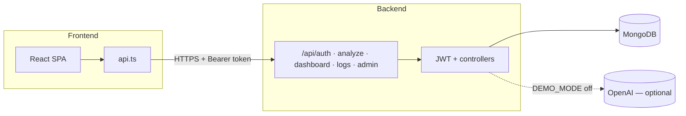
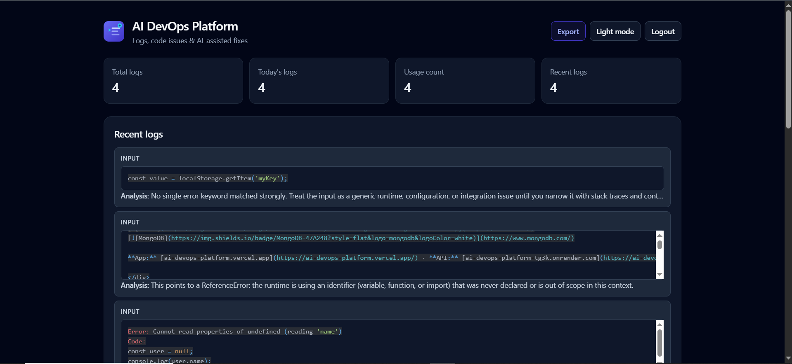
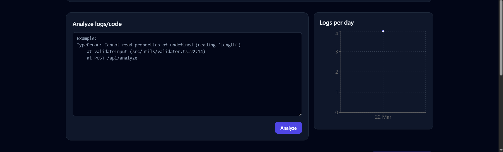
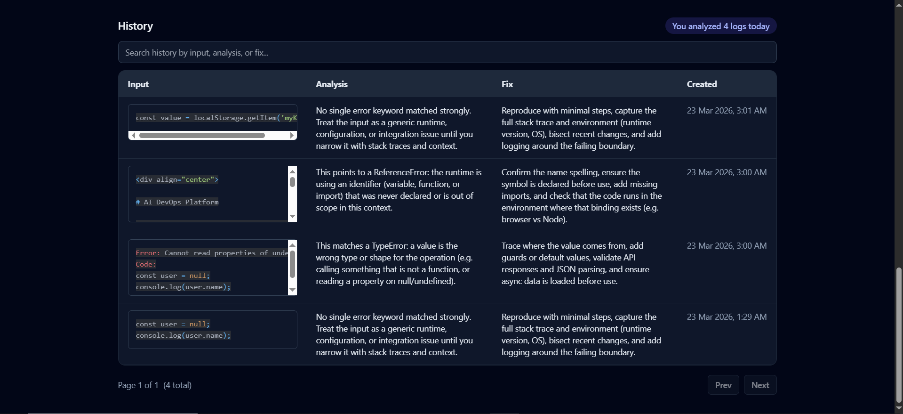
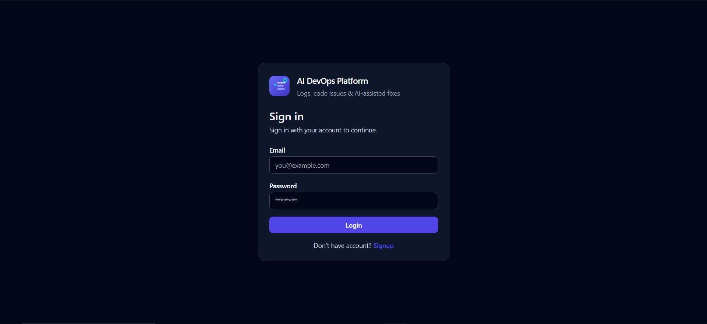
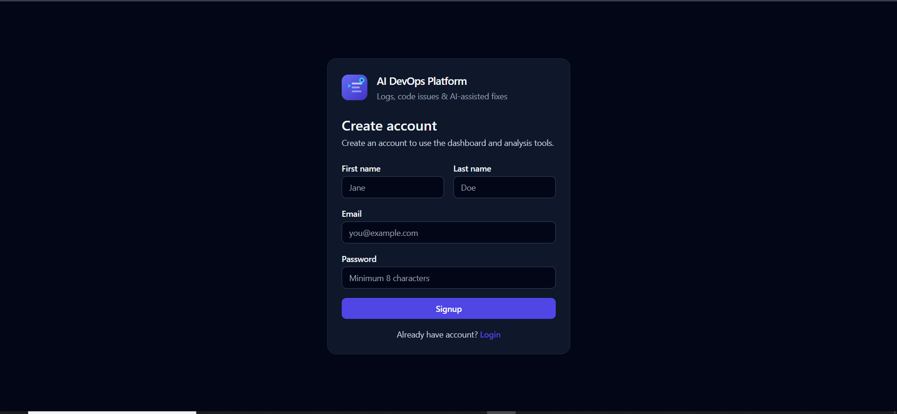
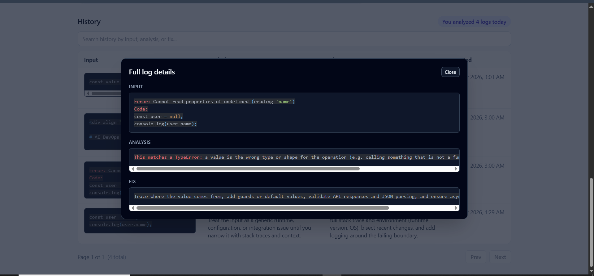
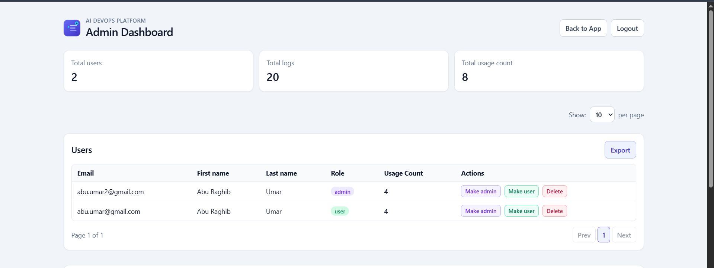
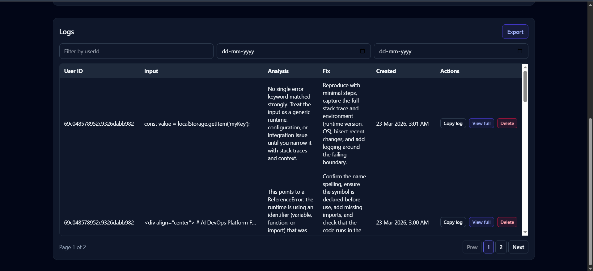
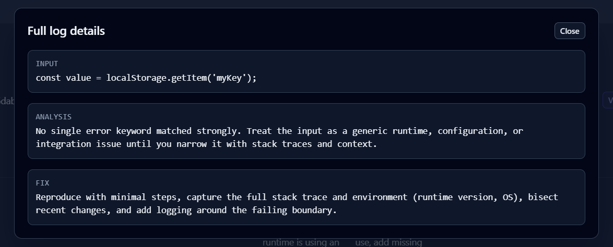

<div align="center">

# AI DevOps Platform

Full-stack **AI-assisted log & code analysis** with history, dashboards, **admin** tools, and **CSV / Excel / PDF** exports.

[](https://ai-devops-platform.vercel.app/)
[](https://github.com/abu-raghib-umar-q3tech/ai-devops-platform)
[](https://www.typescriptlang.org/)
[](https://react.dev/)
[](https://www.mongodb.com/)

**App:** [ai-devops-platform.vercel.app](https://ai-devops-platform.vercel.app/) · **API:** [ai-devops-platform-tg3k.onrender.com](https://ai-devops-platform-tg3k.onrender.com/) · **Repo:** [github.com/abu-raghib-umar-q3tech/ai-devops-platform](https://github.com/abu-raghib-umar-q3tech/ai-devops-platform)

</div>

---

## Table of contents

- [Overview](#overview)
- [Features](#features)
- [Tech stack](#tech-stack)
- [Architecture](#architecture)
- [Project structure](#project-structure)
- [Prerequisites](#prerequisites)
- [Local development](#local-development)
- [Deployment](#deployment)
- [Environment variables](#environment-variables)
- [Analysis &amp; caching](#analysis--caching)
- [API reference](#api-reference)
- [Admin UI URL queries](#admin-ui-url-queries)
- [Database](#database)
- [Frontend API client](#frontend-api-client)
- [Screenshots](#screenshots)

---

## Overview

Teams lose time decoding stack traces and log output. This platform gives users one place to **paste an error or snippet**, receive a structured **analysis** and **suggested fix**, and **store every run** for search and reporting. **Admins** see usage, filter activity, manage roles, and **export** data without leaving the browser.

Authentication is **JWT-based**; the UI uses protected routes and a separate **admin** experience backed by role-checked APIs.

---

## Features

- **Authentication & authorization**
  - Sign up / sign in, JWT sessions
  - Protected routes in the React app
  - Admin-only APIs and `/admin` UI
- **Analysis workflow**
  - Submit logs or code via `POST /api/analyze`
  - Response: `analysis` + `fix` (copy-friendly in the UI)
  - **OpenAI** when configured, or **`DEMO_MODE`** with rule-based `smartFallback`
  - **Cache:** identical `input` returns the stored result immediately (no duplicate log, no usage bump)
- **History & exports**
  - Paginated history with optional search (`q`) across input / analysis / fix
  - Row click opens a modal with syntax-highlighted content
  - User exports: **CSV** (UTF-8 BOM for Excel) and **Excel** with wide columns
  - Admin exports: users and logs → **CSV**, **Excel**, **PDF**
- **Dashboard**
  - Totals, today’s count, recent logs preview
  - **Logs per day** chart (UTC buckets)
- **Admin**
  - Stats cards, paginated users and logs
  - Filters: `userId` substring, date range (`from` / `to`)
  - Promote/demote role, delete users (and their logs) or individual logs
  - List state synced to the **URL** for shareable views
- **UX**
  - Dark mode, toast notifications, lazy-loaded chart and modal chunks

---

## Tech stack

**Frontend**

- React 19, TypeScript, Vite
- Tailwind CSS, React Router
- Recharts, react-hot-toast, react-syntax-highlighter
- jsPDF + jspdf-autotable (client-side PDF where used)

**Backend**

- Node.js, Express 5, TypeScript
- MongoDB + Mongoose
- `jsonwebtoken`, `bcryptjs`
- `openai` SDK
- `exceljs`, `pdfkit` (spreadsheet / PDF exports)

---

## Architecture



---

## Project structure

```
ai-devops-platform/
├── backend/              # Express API, models, export logic
│   └── src/
├── frontend/             # Vite + React SPA
│   └── src/
├── screenshots/          # README / demo images
└── README.md
```

---

## Prerequisites

- **Node.js** 18+ (20+ recommended)
- **MongoDB** (local or Atlas)
- **OpenAI API key** — optional if you run with `DEMO_MODE=true`

---

## Local development

```bash
git clone https://github.com/abu-raghib-umar-q3tech/ai-devops-platform.git
cd ai-devops-platform
```

**Backend**

```bash
cd backend
npm install
cp .env.example .env    # Windows: copy .env.example .env
# Edit .env (at minimum JWT_SECRET; MONGO_URI if not using default local DB)
npm run dev
```

**Frontend**

```bash
cd frontend
npm install
cp .env.example .env
# VITE_API_BASE_URL=http://localhost:5000/api
npm run dev
```

Open the Vite URL (typically `http://localhost:5173`).

**Production builds**

```bash
cd backend && npm run build && npm start
```

```bash
cd frontend && npm run build
```

Serve `frontend/dist` as a static site. This repo includes `frontend/vercel.json` for SPA fallback routing on Vercel.

---

## Deployment

| Part     | Production URL                                                                        | Notes                                                                                                                                                    |
| -------- | ------------------------------------------------------------------------------------- | -------------------------------------------------------------------------------------------------------------------------------------------------------- |
| Frontend | [ai-devops-platform.vercel.app](https://ai-devops-platform.vercel.app/)               | Set **`VITE_API_BASE_URL`** to your API **including `/api`**, e.g. `https://ai-devops-platform-tg3k.onrender.com/api`. Redeploy after changing `VITE_*`. |
| Backend  | [ai-devops-platform-tg3k.onrender.com](https://ai-devops-platform-tg3k.onrender.com/) | Set **`MONGO_URI`**, **`JWT_SECRET`**, and either **`OPENAI_*`** or **`DEMO_MODE=true`**.                                                                |

---

## Environment variables

### Backend (`backend/.env`)

See `backend/.env.example` for a full template.

| Variable             | Required       | Description                                                        |
| -------------------- | -------------- | ------------------------------------------------------------------ |
| `PORT`               | No             | HTTP port (default `5000`)                                         |
| `MONGO_URI`          | No\*           | MongoDB connection string (default local dev URI in code if unset) |
| `JWT_SECRET`         | **Yes** (prod) | Secret for signing JWTs                                            |
| `JWT_EXPIRES_IN`     | No             | e.g. `1d`                                                          |
| `BCRYPT_SALT_ROUNDS` | No             | Password hashing cost                                              |
| `DEMO_MODE`          | No             | `true` → skip OpenAI, use `smartFallback` heuristics only          |
| `OPENAI_API_KEY`     | If AI enabled  | OpenAI API key                                                     |
| `OPENAI_MODEL`       | No             | e.g. `gpt-4o-mini`                                                 |

\*Mongo must be reachable from the API process.

### Frontend (`frontend/.env`)

| Variable            | Example                                                                           |
| ------------------- | --------------------------------------------------------------------------------- |
| `VITE_API_BASE_URL` | `http://localhost:5000/api` or `https://ai-devops-platform-tg3k.onrender.com/api` |

---

## Analysis & caching

1. **Cache lookup** — If a log already exists with the same `input`, the API returns its stored `analysis` / `fix` immediately (no new `Log` document, no `usageCount` increment).
2. **`DEMO_MODE=true`** — No OpenAI call; responses use keyword / pattern rules (e.g. ReferenceError, TypeError, Mongo, network-style text).
3. **`DEMO_MODE=false`** — OpenAI is used when the key is set; on API or parse failure, the handler falls back to the same smart rules.

---

## API reference

Unless noted, protected routes expect:

`Authorization: Bearer <access_token>`

### Auth

| Method | Path               | Description                                                                                     |
| ------ | ------------------ | ----------------------------------------------------------------------------------------------- |
| `POST` | `/api/auth/signup` | Body: `firstName`, `lastName`, `email`, `password` — names trimmed, 1–100 chars; password min 8 |
| `POST` | `/api/auth/login`  | Body: `email`, `password` — response includes `user` with names                                 |
| `GET`  | `/api/auth/me`     | Current user profile                                                                            |

### Analysis

| Method | Path           | Description                                      |
| ------ | -------------- | ------------------------------------------------ |
| `POST` | `/api/analyze` | Body: `{ "input": "..." }` → `{ analysis, fix }` |

### User dashboard & logs

| Method | Path                    | Description                                                                |
| ------ | ----------------------- | -------------------------------------------------------------------------- |
| `GET`  | `/api/dashboard/stats`  | `totalLogsCount`, `todaysLogsCount`, `last5Logs`, `logsPerDay` (UTC dates) |
| `GET`  | `/api/logs/history`     | Query: `page`, `limit` (max 100), optional `q`                             |
| `GET`  | `/api/logs/export`      | User history CSV (UTF-8 BOM)                                               |
| `GET`  | `/api/logs/export/xlsx` | User history Excel (column widths)                                         |

### Admin (requires **admin** role)

| Method   | Path                            | Description                                                                    |
| -------- | ------------------------------- | ------------------------------------------------------------------------------ |
| `GET`    | `/api/admin/stats`              | `totalUsers`, `totalLogs`, `usageCountSum`                                     |
| `GET`    | `/api/admin/users`              | Paginated users: `page`, `limit` (max 100)                                     |
| `GET`    | `/api/admin/logs`               | Paginated logs; optional `userId`, `from`, `to` (`YYYY-MM-DD`, UTC day bounds) |
| `GET`    | `/api/admin/logs/export`        | All logs CSV                                                                   |
| `GET`    | `/api/admin/logs/export/xlsx`   | All logs Excel                                                                 |
| `GET`    | `/api/admin/logs/export/pdf`    | All logs PDF (landscape A4)                                                    |
| `GET`    | `/api/admin/users/export`       | Users CSV                                                                      |
| `GET`    | `/api/admin/users/export/xlsx`  | Users Excel                                                                    |
| `GET`    | `/api/admin/users/export/pdf`   | Users PDF                                                                      |
| `PATCH`  | `/api/admin/users/:userId/role` | Body: `{ "role": "admin" \| "user" }`                                          |
| `DELETE` | `/api/admin/users/:userId`      | Deletes user and their logs                                                    |
| `DELETE` | `/api/admin/logs/:logId`        | Deletes one log                                                                |

`export` routes are registered **before** parameterized `/:id` routes so `export` is not treated as an id.

---

## Admin UI URL queries

The admin page mirrors table state into the query string (defaults are omitted):

| Query         | Meaning                                            |
| ------------- | -------------------------------------------------- |
| `userId`      | Logs filter (substring); debounced ~300 ms         |
| `page`        | Logs table page                                    |
| `usersPage`   | Users table page                                   |
| `limit`       | Page size for **both** tables: `10`, `20`, or `50` |
| `from` / `to` | Log date range (`YYYY-MM-DD`, UTC)                 |

Example: `/admin?userId=prod&page=2&limit=20`

---

## Database

The `Log` collection uses a compound index `{ userId: 1, createdAt: -1 }` for efficient admin queries. Mongoose creates indexes on connect; if you manage schema outside the app, run `syncIndexes` or equivalent migrations.

---

## Frontend API client

Typed helpers live in **`frontend/src/services/api.ts`**: auth, `analyze`, dashboard stats, `getHistory`, user exports, and admin helpers such as `getAdminStats`, `getAdminUsers`, `getAdminLogs`, `exportAdminLogsXlsx`, `exportAdminUsersPdf`, etc.

---

## Screenshots

PNG files live in [`screenshots/`](screenshots/). Below are the **main dashboard** views; expand **More screens** for auth, log detail modal, and admin.

### Dashboard (overview)

**Stats & recent log**



**Analyze**



**History**



<details>
<summary><strong>More screens — auth, log details, admin</strong></summary>

### Authentication

**Login**



**Sign up**



### Dashboard

**Full log details (modal)**



### Admin

**Stats & users table**



**Logs table**



**Full log details**



</details>

---
